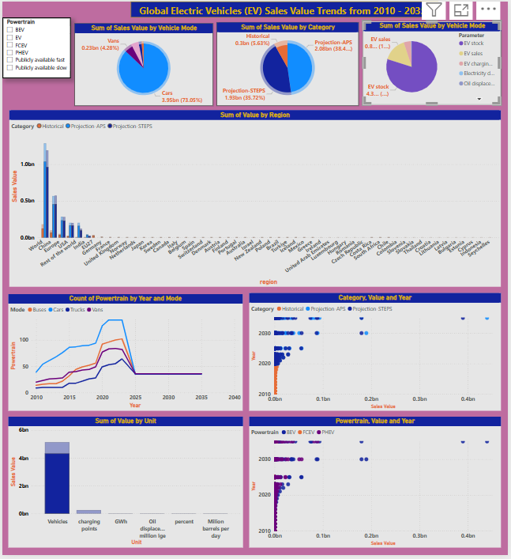

# 

# Global Electric Vehicle Sales trends from 2010-2024

**Global EV sales trends 2010 - 2024** seeks to analyse sales and stock data of electric vehicles trend globally. By analysing the trend in EV adoption per region or even per country, helps the businesses (EV manufacturers to car dealerships) to understand which regions of the world are purchasing more EVs and in what type of vehicle mode. This project will help businesses to predict future EV sales, for example by 2035, using the insights gained from this data that covers 2010 to 2024. By understanding factors like vehicle mode and count per region helps businesses to make decisions on whether to invest in EVs in a particular region or not. It also helps gorvenment authorities whether to invest in EV infrastructure or not, like charging stations. This project will help vehicle manufacturers to predict adoption of EVs by different regions by the yeaar 2035 and beyond. The predictions are achieved by the use of insights gained from the 2010-2024 data.
The manufacturers would also gain understanding on which EV type is more trendig between BEV, PHEV or HEV segments and in which regions for better decision making. The insights gained from data analysis and visualisations is achieved using different methods of analytics.

## Dataset Content
* The data set contains 8 column variables with values column which refers to sales values for different types of vehicle modes and EV types. The data categories include region, category, parameter, mode, powertrain, year, unit and value. The data set is useful to understand global trends in EV sales. The data set is available in: https://www.kaggle.com/datasets/patricklford/global-ev-sales-2010-2024/data.

## Business Requirements
* Identify long-term growth trends in the global EV market from 2010 to 2024.
* Analyze regional adoption rates and key market drivers influencing sales.
* Evaluate competitive landscape and top EV manufacturers over the years.
* Predict future market trends using historical data and forecasting techniques.
* Provide insights to optimize marketing strategies and sales initiatives.
* Collect EV sales data from reliable sources (e.g., industry reports, government databases, manufacturer reports).
* Categorize data by year, region, vehicle type (battery electric, hybrid, etc.), and manufacturer.
* Collect data on government incentives and policy changes impacting EV adoption. 

## Hypothesis and how to validate?
* Hypothesis 1: The global sales of electric vehicles (EVs) have shown a consistent year-over-year increase from 2010 to 2024 and are projected to continue the trend to 2035.
How to validate it: Perform a time series analysis on the annual EV sales data to identify trends and calculate the year-over-year growth rates.

* Hypothesis 2: The adoption rate of electric vehicles varies significantly by region, influenced by factors such as economic development, infrastructure availability, and cultural attitudes towards sustainability.
How to validate it: Perform a regional analysis of EV sales data, comparing adoption rates across different regions. Use statistical tests to determine if there are significant differences in adoption rates and identify the key factors influencing these differences.

* Hypothesis 3: Battery electric vehicles (BEVs) have experienced higher growth rates compared to plug-in hybrid electric vehicles (PHEVs) and hybrid electric vehicles (HEVs) from 2010 to 2024.
How to validate it: Analyze the sales data by powertrain (powertrain and value) to compare the growth rates of BEVs, PHEVs, and HEVs. Use trend analysis to identify which powertrain type has the highest growth rate.

* Hypothesis 4: The mode of electric vehicles (e.g., passenger cars, buses, vans) influences their adoption rates, with passenger cars showing higher adoption rates compared to other modes.

Validation Approach: Analyze the sales data by mode (mode and value) to compare the adoption rates of different vehicle modes. Use statistical tests to determine if there are significant differences in adoption rates between passenger cars and other modes.

## Project Plan
* Kanban planning: The kanban project planning is used to plan for tasks and tracking of tasks as the project progresses.
* Data Collection: Load the dataset from the Kaggle.
* Save the file in the folder in the directory
* Data Cleaning: Handle missing values, check duplicates, and standardise formats.Processing, analysis and interpretation of data, some of the methods used are like df.info(), df.isnull().sum().
* Data Transformation: Nothing to clean as the dataset had no duplicates or missing values.
* Save the cleaned file in a new folder in the directory.
* Analysis: Perform exploratory data analysis, trend analysis, and correlation analysis
* Modeling: Predict EV sales through coming years.
* Visualization: Build dashboards from Power Bi to present insights and predictions.

## The rationale to map the business requirements to the Data Visualisations
* Identify long-term growth trends in the global EV market from 2010 to 2024.
Visualization: Line charts showing annual EV sales over time.
Rationale: Line charts are effective for displaying trends over time, making it easy to identify growth patterns and year-over-year changes.

* Analyze regional adoption rates and key market drivers influencing sales.
Visualization: Bar charts and heatmaps comparing EV sales across different regions.
Rationale: Bar charts provide a clear comparison of sales volumes across regions, while heatmaps can highlight regions with higher or lower adoption rates, making it easier to identify key market drivers.

* Evaluate competitive landscape and top EV manufacturers over the years.
Visualization: Stacked bar charts or pie charts showing market share of top EV manufacturers.
Rationale: Stacked bar charts and pie charts effectively display the distribution of market share among manufacturers, helping to evaluate the competitive landscape.

## Analysis techniques used
* Data Analysis methods: In EDA methods like .value_counts() and df.describe() were used to analyse the data to understand the mean, median and standard deviation.
* Data Analysis methods: Methods like Bar charts, Histograms, scatter plts and correlation heatmaps were utilised for furthet analysis. 
* Pandas, Matplot lib and Plotly were utilised to get high quality visualisations.
* Use of AI Tools: ChatGPT was used for brainstorming business requirements and personification of the prompts. GitHub Copilot was used to prompt for hypotheses and improving code.

## Ethical considerations
* There Were no any personal data that could have violated any data privacy, bias or fairness issues with the data and there was nothing to anonymise.
* The data is within what is legally allowed from Kaggle.

## Dashboard Design
* Dashboarding was perfomed in Power Bi. Attached is the image/snippet of the dashboard 
* Power Bi Dashboard link: https://app.powerbi.com/groups/me/reports/05e9c51e-1f54-4578-8fd5-0334346af2a5/ae481787b0969eb49e51?experience=power-bi

## Unfixed Bugs
* Please mention unfixed bugs and why they were not fixed. This section should include shortcomings of the frameworks or technologies used. Although time can be a significant variable to consider, paucity of time and difficulty understanding implementation are not valid reasons to leave bugs unfixed.
* Did you recognise gaps in your knowledge, and how did you address them?
* If applicable, include evidence of feedback received (from peers or instructors) and how it improved your approach or understanding.

## Development Roadmap
* Reinforcement of visualisations and use of different charts and graphs. 

## Main Data Analysis Libraries
* Pandas -  To load a CSV file with Python, we will use a library called Pandas as It has a specific function that reads CSV files by parsing the file path.
* NumPy - For processing data in arrays
* Matplotlib - charts 
* Seaborn - charts
* Plotly -  Charts
(import pandas as pd 
import numpy as np
import matplotlib.pyplot as plt
import seaborn as sns
sns.set_style('whitegrid')
import plotly.express as px)
* Example
(Fig, axes = plt.subplots(figsize=(22,9))
sns.scatterplot(data=df, x='value', y='region', hue='mode') 
plt.show()

## Credits 
* https://www.kaggle.com/datasets/patricklford/global-ev-sales-2010-2024/data
* https://learn.codeinstitute.net

## Acknowledgements (optional)
* Thanks to Niel, Vasi and some of my colleagues who helped with different aspects for me to achieve the analysis of data and finishing the project.